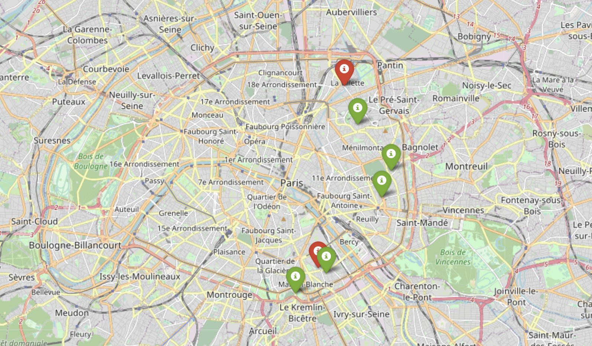

# Hackathon_TeensInIA_AntiPauvrete

## Présentation du Hackathon
L'objectif de TeensInAI est de démocratiser l'AI et d'inspirer la prochaine génération. A l'occasion de la Journée Internationale des Droits des Femmes, Société Générale, Accenture et Microsoft soutiennent TeensInAI pour son Hackathon en ligne GirlsInAI, événement virtuel adressé aux jeunes de 12 à 18 ans. Les sujets du Challenge sont en lien direct avec les Objectifs du Développement Durable des Nations Unies et visent notamment l'égalité entre les genres et la réduction des inégalités.

## Présentation de la solution proposée 

### Problématique 
Comment aider les sans-domiciles-fixes au quotidien grâce à l’intelligence artificielle ?

### Solution proposée
Création d'une application mobile et/ou site internet permettant de proposer des solutions d’aides au personnes sans domicile fixes (hébergements agrémentés, maison d’accueil, centre de restauration adaptés etc…) proche d’eux

### Code
Afficher les centres d'hébergements parisiens sur une carte. 
* En vert : les CHRS et CHRS-CHU
* En rouge : les CHU
* 

Afficher le chemin (à vol d'oiseau) d'une position gps (latitude, longitude) au centre d'hébergement le plus proche. 

